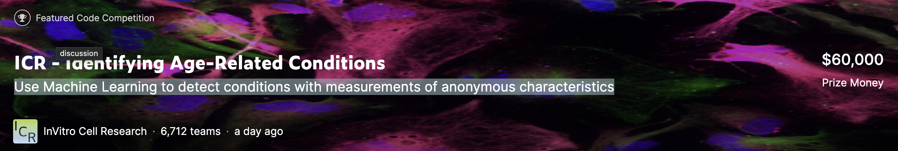

# ICR - Identifying Age-Related Conditions
Use Machine Learning to detect conditions with measurements of anonymous characteristics



[ICR - Identifying Age-Related Conditions](https://www.kaggle.com/competitions/icr-identify-age-related-conditions)

## Competition Introduction
The goal of this competition is to predict if a person has any of three medical conditions. 
You are being asked to predict if the person has one or more of any of the three medical conditions (Class 1), 
or none of the three medical conditions (Class 0). 
You will create a model trained on measurements of health characteristics.
- Type: Disease prediction
- Recommended Model: Basic ML Models(Random Forest, SVM, LR,...)
- Evaluation Metrics: balanced logarithmic loss
- Baseline: 

## Data Introduction
### train.csv - The training set.
Id - Unique identifier for each observation. \
AB-GL - Fifty-six anonymized health characteristics. All are numeric except for EJ, which is categorical. \
Class A binary target - 1 indicates the subject has been diagnosed with one of the three conditions, 0 indicates they have not. 
### test.csv - The test set. 
Your goal is to predict the probability that a subject in this set belongs to each of the two classes.
### greeks.csv - Supplemental metadata, only available for the training set.
Alpha -  Identifies the type of age-related condition, if present. \
A - No age-related condition. Corresponds to class 0. \
B, D, G - The three age-related conditions. Correspond to class 1. \
Beta, Gamma, Delta - Three experimental characteristics. \
Epsilon - The date the data for this subject was collected. Note that all of the data in the test set was collected after the training set was collected.


## Solution Approach

Initially, I utilized LightGBM with Optuna for hyperparameter tuning, running 100 trials. Post-analysis of the feature importance plot led me to limit the feature list and ensemble five LightGBM models. The cross-validation displayed an impressive AUC of 0.99, yet the leaderboard (LB) score wasn't as good as expected (0.22).

Recognizing this, I delved into diagnosing the issue and improving the model. I discovered:

- The task was disease detection, thereby making recall a priority over AUC.
- The training data size was small (<700 rows), increasing the risk of overfitting with LightGBM or Neural Networks.
- The data was imbalanced with less than 200 positive instances, which was only 17% of the total.

In light of these insights, I initiated several improvements:

- Applied KNN Imputer for missing value treatment.
- Utilized Synthetic Minority Over-sampling Technique (SMOTE) to balance the positive and negative instances.
- Shifted my ensemble strategy from averaging 5 LightGBM models to a voting system encompassing logistic regression, random forest, and SVM models.
- Changed the cross-validation metric from AUC to recall.

which improved the leaderboard score from 0.64 to 0.53.

**Rank 3077/6713 TOP 45%**


## Updates

- 5 lightGBM models ensemble: CV - AUC 0.99
- KNN Imputer + nomalization scaler + SMOTE(treating unbalanced classes) + Voting Ensemble among LR model & SVM & Random Forest Model: CV recall:0.98

## Core code 

```Python
X_train,y_train,X_test = train_data[feat_names],train_data['Class'],test_data[feat_names]

#KNN Imputer(I checked X_test doesnt have missing values)
imputer = KNNImputer(n_neighbors=3)
X_imputed = pd.DataFrame(imputer.fit_transform(X_train), columns = X_train.columns)

print("Before SMOTE: ", sorted(Counter(y_train).items()))
# Create a SMOTE instance
sm = SMOTE(random_state=42)

# Apply SMOTE to training data
X_train_res, y_train_res = sm.fit_resample(X_imputed, y_train)
# Print the count of each class in the training set after applying SMOTE
print("After SMOTE: ", sorted(Counter(y_train_res).items()))


scaler = StandardScaler()
X_train_scaled = scaler.fit_transform(X_train_res)
X_test_scaled = scaler.transform(X_test)

# Validation Placeholder
# from sklearn.model_selection import TimeSeriesSplit
# tscv = TimeSeriesSplit(5) 
# for fold, (trn_ind, val_ind) in enumerate(tscv.split(X_train_res)):
#     train_df = X_train_res[trn_ind] 
#     valid_df = X_train_res[val_ind] 
    
# print(f"train_df.shape:{train_df.shape}; valid_df.shape:{valid_df.shape}") 


X_train, y_train = X_train_scaled, y_train_res

# Create the individual models
log_clf = LogisticRegression(max_iter=500)
rf_clf = RandomForestClassifier()
svm_clf = make_pipeline(StandardScaler(), SVC(probability=True))  # Scale data for SVM and set probability=True

# Create the ensemble model
voting_clf = VotingClassifier(
    estimators=[('lr', log_clf), ('rf', rf_clf), ('svm', svm_clf)],
    voting='soft')  # Using 'soft' voting to predict the class label based on the argmax of the sums of the predicted probabilities

# Define the hyperparameters to tune for each model
param_grid = {
    'lr__C': [0.1, 1.0, 10.0],
    'rf__n_estimators': [50, 100, 200],
    'svm__svc__C': [0.1, 1.0, 10.0],
}

# Create the grid search object
grid_search = GridSearchCV(voting_clf, param_grid, cv=5, scoring='recall')

# Fit the grid search object
grid_search.fit(X_train, y_train)

# Print the optimal parameters
print(grid_search.best_params_)

# voting ensemble 
best_params = grid_search.best_params_
# Create the individual models
log_clf = LogisticRegression(C=best_params['lr__C'])
rf_clf = RandomForestClassifier(n_estimators=best_params['rf__n_estimators'])
svm_clf = make_pipeline(StandardScaler(), SVC(probability=True, C=best_params['svm__svc__C']))


# Create the ensemble model
voting_clf = VotingClassifier(
    estimators=[('lr', log_clf), ('rf', rf_clf), ('svm', svm_clf)],
    voting='soft')  # Using 'soft' voting to predict the class label based on the argmax of the sums of the predicted probabilities

# Fit the ensemble model
voting_clf.fit(X_train, y_train)

# Evaluate the ensemble's performance using cross-validation
scores = cross_val_score(voting_clf, X_train, y_train, cv=5, scoring='recall')
print("Recall: %0.2f (+/- %0.2f)" % (scores.mean(), scores.std() * 2))
```

## Conclusion

